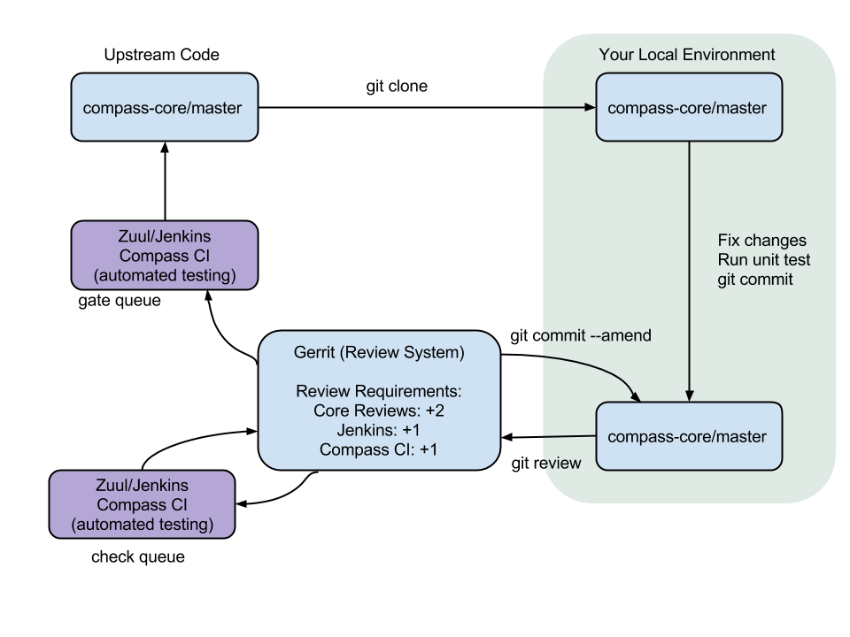




  <h1>How To Contribute</h1>
  





<h2>Contents</h2>
<ul>
    <li>
        <a href='#How_can_i_help'>
            1
            How can I help?
        </a>
    </li>
        <ul>
            <li>
                <a href='#If_you_are_a_developer'>
                    1.1
                    If you are a developer
                </a>
            </li>
                <ul>
                    <li>
                        <a href='#Bug_fixing'>
                            1.1.1
                            Bug fixing
                        </a>
                    </li>
                    <li>
                        <a href='#Housekeeping'>
                            1.1.2
                            Housekeeping
                        </a>
                    </li>
                    <li>
                        <a href='#Feature_development'>
                            1.1.3
                            Feature development
                        </a>
                    </li>
                    <li>
                        <a href='#Reviewing'>
                            1.1.4
                            Reviewing
                        </a>
                    </li>
                </ul>
            <li>
                <a href='#If_you_are_a_tester'>
                    1.2
                    If you are a tester
                </a>
            </li>
        </ul>
    <li>
        <a href='#Developer_guide_of_compass_manual'>
            2
            Developer's Guide of Compass Manual
        </a>
    </li>
        <ul>
            <li>
                <a href='#Quick_reference'>
                    2.1
                    Quick reference
                </a>
            </li>
            <li>
                <a href='#Getting_started'>
                    2.2
                    Getting started
                </a>
            </li>
                <ul>
                    <li>
                        <a href='#Account_setup'>
                            2.2.1
                            Account setup
                        </a>
                    </li>
                    <li>
                        <a href='#Setting_up_git_configuration'>
                            2.2.2
                            Setting up git configuration
                        </a>
                    </li>
                    <li>
                        <a href='#Installing_git_review'>
                            2.2.3
                            Installing git-review
                        </a>
                    </li>
                    <li>
                        <a href='#Starting_work_on_project'>
                            2.2.4
                            Starting work on project
                        </a>
                    </li>
                </ul>
            <li>
                <a href='#Development_workflow'>
                    2.3
                    Development workflow
                </a>
            </li>
                <ul>
                    <li>
                        <a href='#Working_on_bugs'>
                            2.3.1
                            Working on bugs
                        </a>
                    </li>
                    <li>
                        <a href='#Working_on_specifications_blueprints'>
                            2.3.2
                            Working on specifications and blueprints
                        </a>
                    </li>
                    <li>
                        <a href='#Compass_core_structure'>
                            2.3.4
                            Compass-core structure
                        </a>
                    </li>
                    <li>
                        <a href='#Testing_compass_project'>
                            2.3.5
                            Testing Compass project
                        </a>
                    </li>
                    <li>
                        <a href='#Starting_a_change'>
                            2.3.6
                            Starting a change
                        </a>
                    </li>
                    <li>
                        <a href='#Committing_a_change'>
                            2.3.7
                            Committing a change
                        </a>
                    </li>
                    <li>
                        <a href='#Submitting_a_change_for_review'>
                            2.3.8
                            Submitting a change for review
                        </a>
                    </li>
                    <li>
                        <a href='#Updating_a_change'>
                            2.3.9
                            Updating a change
                        </a>
                    </li>
                </ul>
            <li>
                <a href='#Code_review'>
                    2.4
                    Code review
                </a>
                    </li>
        </ul>
</ul>

<h2 id='How_can_i_help'>How can I help?</h2>

Please join our communication forums:

<ul>
    <li>Subscribe <a href="https://groups.google.com/a/syscompass.org/forum/?hl=en#!forum/users">Compass users Google Group</a>.</li>
    <li>Send email to <a href="mailto:dev@syscompass.org">dev@syscompass.org</a>.</li>
</ul>

<h2 id='If_you_are_a_developer'>If you're an developer</h2>
<ul>
    <li>Check out how we work</li>
        <ul>
             <li>What is <a href='https://wiki.openstack.org/wiki/Compass'>compass</a>, and how it works.</li>
        </ul>
    <li>Read the <a href='#'>Developer's Guide of Compass Manual</a> to get started</li>
    <li>Learn how to work with Openstack Gerrit review system.</li>
    <li>Review code</li>
</ul>

<h3 id='Bug_fixing'>Bug fixing</h3>

You can start to contribute with bug fixing. Confirmed bugs are usually good targets. Here is the list of <a href='https://bugs.launchpad.net/compass'>bugs</a> that have been reported.

You can provide instruction on how to fix a certain bug. Or you can directly fix it: assign the bug to youself, set the status to <i>IN PROGRESS</i>,
branch the code, implement the fix, and propose your change. Once your fix has been merged, come back and add a commit then check the status to <i>FIX COMMITTED</i>.

<h3 id='Housekeeping'>Housekeeping</h3>

Maitaining good code quality is a non-stopping work that share with all development team member. There are always several constant work you can help with. For instance, adding explaining comments in code, reducing pylint violations, increasing code coverage. Those are good ways to get involved, and it will let you to get familiar with different part of code.

<h3 id='Feature_development'>Feature development</h3>

Once you are comfortable with the code, you can start to share your idea by contributing new feature. We use Openstack Launchpad Blueprints and Specs to track the design and implementation of significant features. By using blueprint, you can propose a deign and contain the sepcification.

To get start, you need to follow this process:

<ul>
    <li>Register your bluepring in Launchpad by going to <a href='https://blueprints.launchpad.net/compass'>https://blueprints.launchpad.net/compass</a> and clicking "Register a blueprint"</li>
    <li>Git clone https://github.com/stackforge/compass-specs.git</li>
    <li>You can find an example spec in specs/template.rst</li>
    <li>Get it reviewed by submitting your patch using Gerrit</li>
    <li>Assignee sets implementation status to "Implemented" when the work is completed</li>
</ul>

For more information, please see: <a href='https://wiki.openstack.org/wiki/Blueprints'>https://wiki.openstack.org/wiki/Blueprints</a>

<h3 id='Reviewing'>Reviewing</h3>

Every patch submitted needs to get reviewed before it can be approved or merged. Any developer in compass team can be your reviewer.
Before you add reviewer, you change needs to pass automated testing. When a new patch is submitted, Jenkins and Compass CI will run the project's tests on the patch. Once completed, Jenkins and Compass CI will report test result to gerrit in the form of a Verified: +/-1 vote. You will need one developer and one menager's reviews to be approved and merged.

For more information, please see: <a href='http://docs.openstack.org/infra/manual/developers.html#code-review'>http://docs.openstack.org/infra/manual/developers.html#code-review</a>

<h2 id='If_you_are_a_tester'>If you are a tester</h2>

We need you to make sure that Compass behaves correctly. Feel free to try compass and report any <a href='https://bugs.launchpad.net/compass'>issue</a>. For how to install compass, please see <a href='http://www.syscompass.org/install.html'>Try Compass</a> for more information.

<h1 id='Developer_guide_of_compass_manual'>Developer guide of compass manual</h1>
<h2 id='Quick_reference'>Quick reference</h2>

<h2 id='Getting_started'>Getting started</h2>

The purpose of this part is to walk you through the concepts and specificactions that should be understood before contributing the Compass.

Before you get into details of the project, a few steps need to be compeleted. Such as setting up a few account on required webstie, signing a contributor license agreement, uploading an ssh key, and installing git-review.

<h3 id='Account_setup'>Account setup</h3>

First of all, you will need a <a href='https://launchpad.net/+login'>Launchpad account</a>, since this is how the Gerrit Code Review system will identify you.
Then, do not forget to <a href='https://www.openstack.org/join/'>join The OpenStack Foundation</a> which is free and required for all code contributors.
Please make sure you use same email address as the one for code contributions, since this will need to match your preferred email address in Gerrit.

Visit <a href='https://review.openstack.org/'>https://review.openstack.org/</a> and click the "Sign In" link at the top-right corner of the page. Login with your Launchpad ID.
The first time you login OpenStack's Gerrit, you will nee to select a unique username.

Every contributor needs to agree to the <a href='https://review.openstack.org/#/settings/agreements'>Individual Contributor License Agreement</a> and provide <a href='https://review.openstack.org/#/settings/contact'>contact information</a>.

<h3 id='Setting_up_git_configuration'>Setting up git configuration</h3>

Run these steps to set up the git configuration. Please ensure the email matches the one in your Gerrit contact information:

<pre>git config --global user.name "Firstname Lastname"
git config --global user.email "your_email@youremail.com"</pre>

To check your git configuration:

<pre>git config --list</pre>

You will also want to upload an SSH key to Gerrit at <a href='https://review.openstack.org/#/settings/ssh-keys'>review.openstack.org</a>, so that you will be able to commit changes for review later.

<h3 id='Installing_git_review'>Installing git-review</h3>

Git-review is a git subcommand that handles all the details of working with Gerrit. Before you start work, make sure git-review has been installed.

On Ubuntu(12.04) or later, git-review is included in the distribution, so install it as any other package:

<pre>apt-get install git-review</pre>

On Fedora 16 and later, Red Hat Enterprise Linux, and CentOS 6.5 and later, you must enable the <a href='http://fedoraproject.org/wiki/EPEL/FAQ#howtouse'>EPEL</a> repository first, then install the package:

<pre>yum install git-review</pre>

All of git-review's interactions with gerrit are sequences of normal git commands.
If you want to know more about what it is doing, just add -v to the options and it will print out all of the commands it is running.

<h3 id='Starting_work_on_project'>Working on the project</h3>

Clone Compass:

<pre>git clone git://git.openstack.org/stackforge/compass-core.git</pre>

You may want to ask git-review to configure your project to bind with Gerrit. If you do not do it at this point, it will do so the first time you submit a patch.
But you may want to do this ahead of time. To do so:

<pre>cd compass-core
git review -s</pre>

Git-review checks that you can log in to gerrit with your ssh key.
It assumes that your gerrit/launchpad user name is the same as the current name. If the user name does not match, it asks you to enter your gerrit/launchpad user name. You can avoid that question by typing the following:

<pre>git config --global gitreview.username yourgerritusername</pre>

If you do not remember your Gerrit user name go to the <a href='https://review.openstack.org/#/settings/'>settings page</a> on gerrit to check it out (it is not your email address).

<h2 id='Development_workflow'>Development workflow</h2>

<h3 id='Working_on_bugs'>Working on bugs</h3>

Bug reports for the project are tracked on Launchpad at <a href='https://bugs.launchpad.net/compass'>https://bugs.launchpad.net/compass</a>.
Contributor may review these reports regularly when looking for work to tackle.

When working on bugs, there are four aspects you need to notice:

<ul>
    <li>When a bug is filed, it is set to "New" status. A "New" bug can be set to "Confirmed" once it has been reproduced and is confirmed as authentic.</li>
    <li>Make sure the bug has been marked "In Progress" if it is assigned.</li>
    <li>If information that caused bugs to be marked as "Incomplete" has been provided, see if more information is required and remind bug reporter if they have not responded after 2-4 weeks.</li>
    <li>Check with assignee if the bug is still being worked on. If not, unassign it and mark it back to "Confirmed".</li>
</ul>

Once you find a bug that you are interested in, assign it to youself. When you submit a patch, please include the bug information  in the commit message as reference so Gerrit can create a link to the bug.
The following options are available:

<pre>Closes-Bug: #1234567 -- use 'Closes-Bug' if the commit is intended to fully fix and close the bug being referenced.
Partial-Bug: #1234567 -- use 'Partial-Bug' if the commit is only a partial fix and more work is needed.
Related-Bug: #1234567 -- use 'Related-Bug' if the commit is merely related to the referenced bug.</pre>

<h3 id='Working_on_specifications_blueprints'>Working on specifications and blueprints</h3>

Compass project has a specs repository which is used to hold approved design specifications for feature and changes to the project.

You can find an example spec in <code>specs/template.rst</code>

Check the repository to learn about the organization.

<pre>git clone https://github.com/stackforge/compass-specs.git</pre>

Specifications are proposed by adding them to the <code>specs/"release"</code>directory and submit it for review.
Launchpad blueprints were used to track the implementation of these significant features and changes in Compass.
The implementation status of a blueprint can be found at the <a href='https://blueprints.launchpad.net/compass'>blueprint</a> in Launchpad.

<h3 id='Compass_core_structure'>Compass-core structure</h3>

After you checkout the Compass project, go inside <code>compass-core</code> directory and take a look at the structure. Here we are going to briefly explain <code>compass-core/compass</code>,
<code>compass-core/conf</code> and <code>compass-core/misc</code>.

<ul>
    <li>Compass: All python code goes here.</li>
    <li>Conf: These config files are used by compass to deploy clusters, not for compass service itself.</li>
    <li>Misc: Contains miscellaneous config files used by system services such as ntp and apache. These services configs are modified specifically for compass service to use.</li>
</ul>

<h3 id='Testing_compass_project'>Testing Compass project</h3>

Before starting to work on the code, it is necessary to test if Compass code runs properly in your local environment. It is recommended to use tox the tun the unit tests.

It is suggested you install tox with pip:

<pre>[apt-get | yum] install python-pip
pip install tox</pre>

If you are using python 2.6, run following under compass-core directory:

<pre>tox -epy26</pre>

For python 2.7, run:

<pre>tox -epy27</pre>

The test result may return with report syas: "EnvironmentError: mysql_config not found".
Sometimes mysql_config is missing on your system or the installer could not find it. Be sure mysql_config is really installed.

For CentOS 6.5 and later, run:

<pre>yum python-devel mysql-devel</pre>

For Ubuntu(12.04) or later, run:

<pre>apt-get install libmysqlclient-dev python-dev</pre>

<h3 id='Starting_a_change'>Starting a change</h3>

Once your local repository is set up, you can start contribute.

Make sure you have the latest upstream changes:

<pre>git remote update
git pull origin</pre>

Once you are done with the changing, you need to run style checks and unit tests to make sure the code is still executable.

<pre>tox -epep8
tox -epy26</pre>

<h3 id='Committing_a_change'>Committing a change</h3>

Git commit messages explain the chage in detail. If your changes are  related to a blueprint or a bug, be sure to mention them in the commit message using the following syntax:

<pre>Implements: blueprint BLUEPRINT
Closes-Bug: ####### (Partial-Bug or Related-Bug are options)</pre>

<h3 id='Submitting_a_change_for_review'>Submitting a change for review</h3>

Once you have committed a change to your local repository, all you need to do to send it to Gerrit for code review:

<pre>git review</pre>

<h3 id='Updating_a_change'>Updating a change</h3>

If you need to make additional changes, make and amend the changes to the existing commit. Leave the Change-ID the way it is. Gerrit knows this is an updated patch for an existing change.

<pre>git commit --amend
git review</pre>

<h2 id='Code_review'>Code review</h2>

When a new patch is uploaded to Gerrit, project's tests are run on the patch by Jenkins and Compass are run by Compass CI. Once completed the test result are reported to Gerrit in the form of a Verified: +/-1 vote.

If a change fails tests in Jenkins or Compass CI, please follow the steps below:

<ul>
    <li>Jenkins and Compass CI leave comments with links to the log files for the test run. Follow those links and check out the output.It will include a console log.</li>
    <li>Examine the console log to determine the cause of the error. If it is related to your change, go fix the problem and upload a new patchset.</li>
    <li>It may be the case that the error is caused by non-deterministic reason like time out which is unrelated to your change. To re-run check, leave a comment on the review: "recheck compassci".
</ul>

Compass requires more than two positive reviews from core team to approve. You need to choose one reviewer from developers and the other from core reviewers. Once the core reviewer you chose believe it is ready, he or she will mrege your change.

Here is the name list of Compass core team(listed alphabetically):

<ul>
    <li>Core reviewer</li>
        <ul>
            <li>Weidong Shao</li>
            <li>Shuo Yang</li>
        </ul>
    <li>Developer</li>
        <ul>
            <li>Xicheng Chang</li>
            <li>Sam Su</li>
            <li>Xiaodong Wang</li>
            <li>Grace Yu</li>
            <li>Jerry Zhao</li>
        </ul>
</ul>



<a href='#top'>Back to Top</a>
