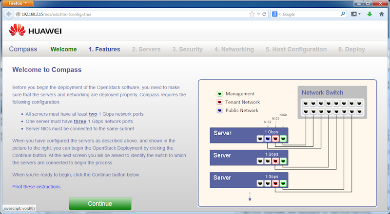
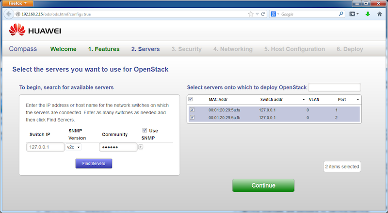



Step 2
------

You will see a page as follows. It explains the networking configuration of a physical rack of servers. In our demo case, we use VMs as the installation targets. Simply click on "Continue" button.

This will lead to a target server selection page. Compass uses SNMP as the discovery mechanism to find all connected servers from a switch. In our demo, we have a special local simulator. So the switch IP is "127.0.0.1", which is pre-filled. Just click on "Find Servers". After a moment, the two server entries appear on the right table. Select both servers, as illustrated in the following picture. Then click on "Continue" button.

<a href="step3.html" class="btn btn-primary btn-lg active" role="button">Next Step</a>

