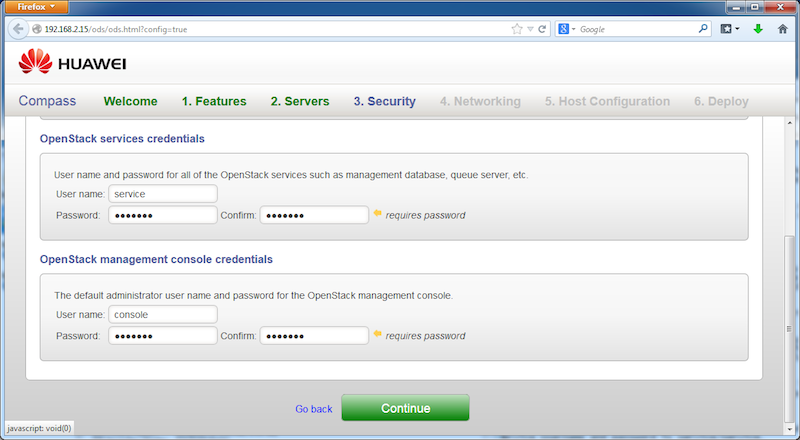



Step 3
------

At this step, we need to provide the system and openstack credentials for the target OpenStack cluster we are about to install. In this demo, simply use the pre-filled values in the UI form, and click on "Continue" button.

<a href="step4.html" class="btn btn-primary btn-lg active" role="button">Next Step</a>

