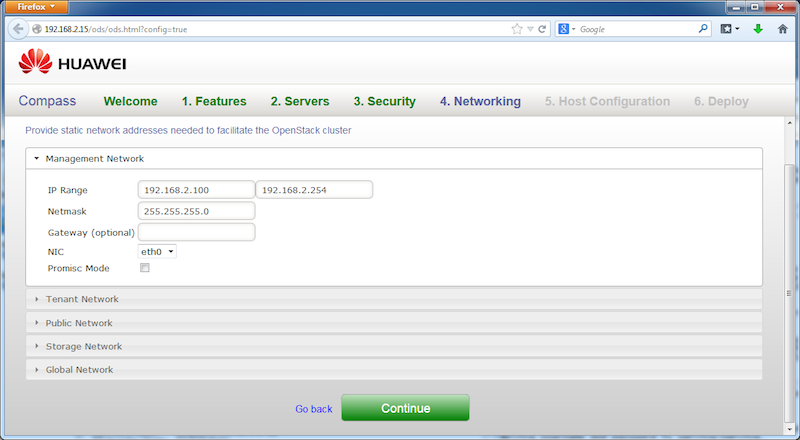



Step 4
------

We now need to provide networking configuration for the target OpenStack cluster we are about to install. In a real situation, you need to fill in the values that is compatible with your overall networking design. In this demo, simply use the pre-filled values in the UI form, and click on "Continue" button.

<a href="step5.html" class="btn btn-primary btn-lg active" role="button">Next Step</a>

