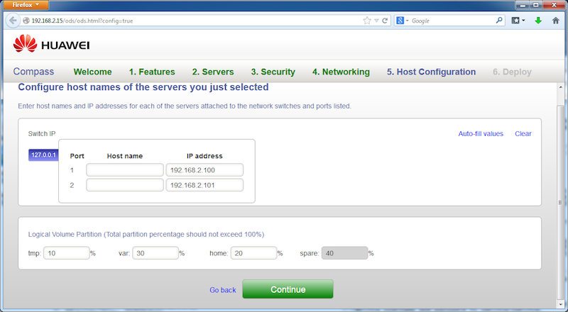
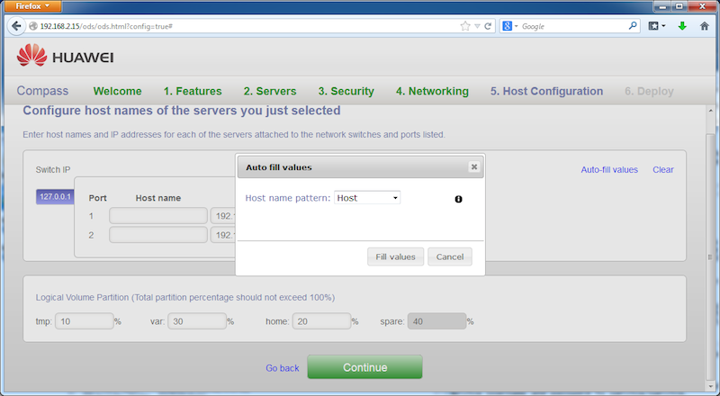
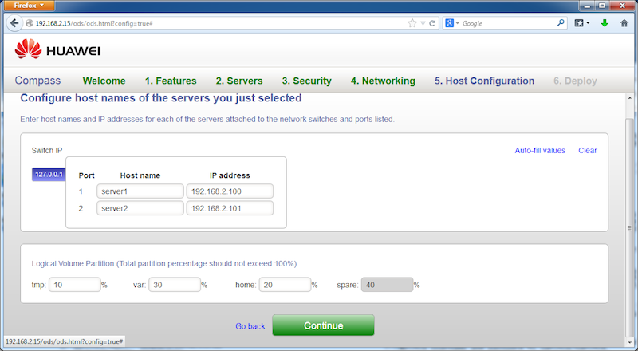



Step 5
------

We now need to edit host configuration for each server in the target OpenStack cluster we are about to install. Compass provides convenience in auto-filling the IP address and host name configuration for the clusters. In this demo, the IP address is auto-assigned from the networking address pool configuration in the previous step. Click on "Auto-fill" link at the top-right of the page. 

In the pop-up dialog, click on "Fill values". This will fill in host names for both hosts in this demo.

The resulting GUI page is as follows:

Click on "Continue" button to go to next step.

<a href="step6.html" class="btn btn-primary btn-lg active" role="button">Next Step</a>