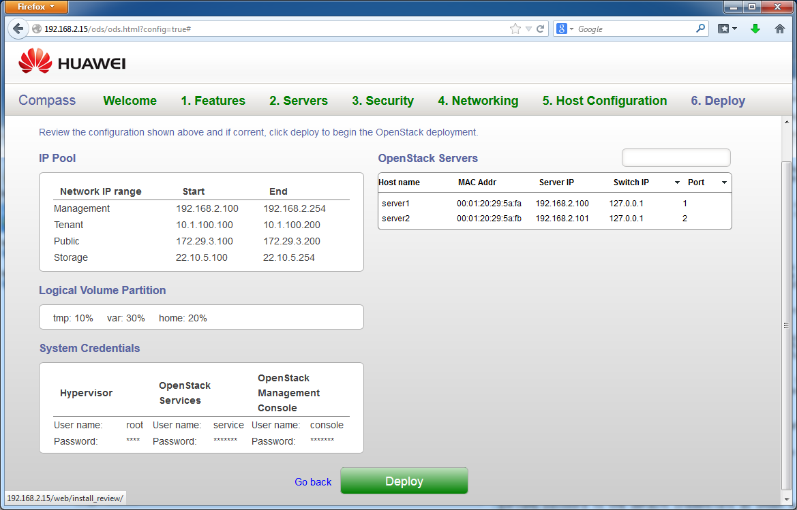
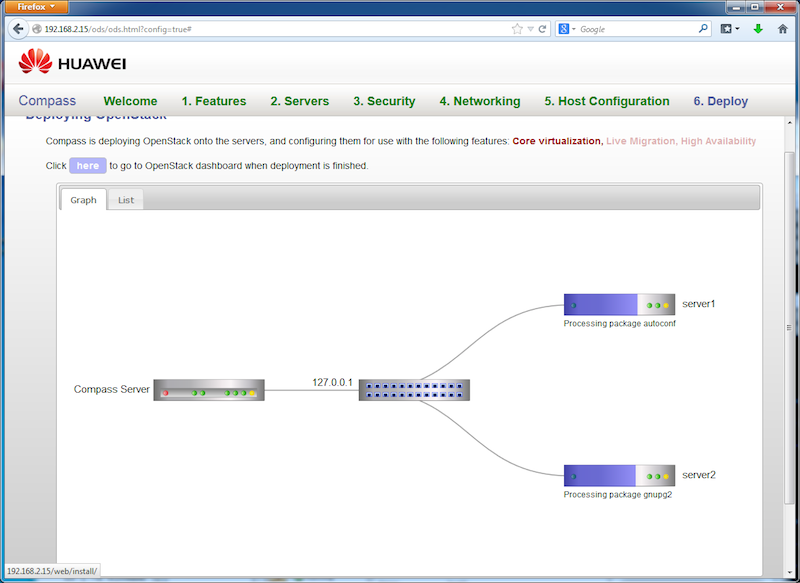



Step 6
------

At this step, Compass presents the overview of the configuration for the target OpenStack cluster we are about to deploy. See the following screen for an example. Click on "Deploy" button to start the deployment process.

In a real situatin, the physical servers will be able to start PXE boot automatically as the deployment process starts. In our demo, however, we have to start the target VMs in VirtualBox.  This can be done from the VirtualBox UI.

Once the VMs are started, each will start the PXE boot and package installation process. This will take some time. In one sample run, it takes about 30 minutes for the process to finish. 

The actual progress will be presented by the Compass progress status page, which is illustrated as follows:

Once the process is finished, you can click on the link (as shown in the above screen) to go to OpenStack dashboard.

