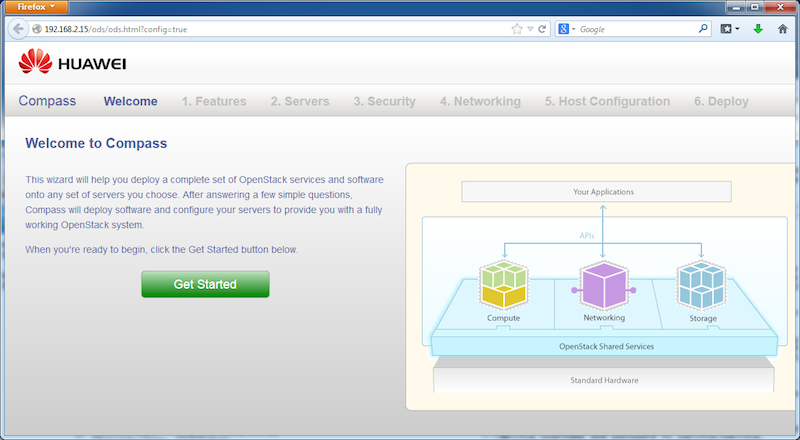



Step 1
------

Open your browser and point to http://192.168.2.15/ You should see the  "Welcome to Compass" page. Click on "Get Started" button.

This will lead to a feature selection page. As of now, the advanced options have not been implemented. Just click on "Continue" button.

<a href="step2.html" class="btn btn-primary btn-lg active" role="button">Next Step</a>

